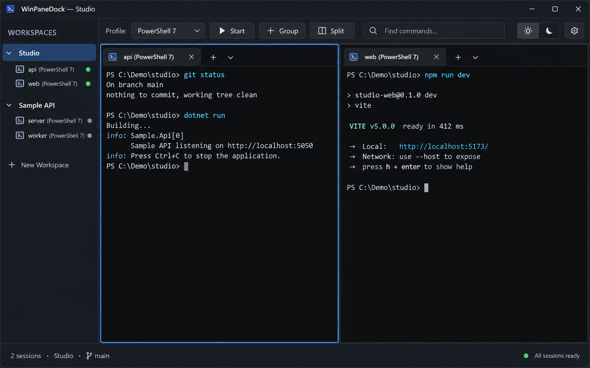
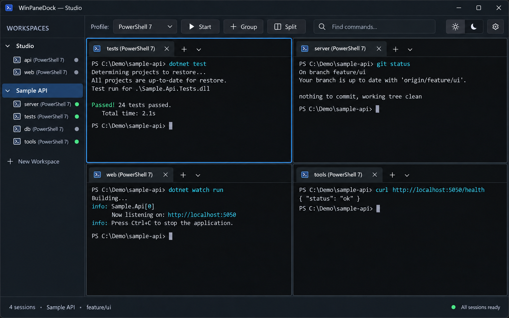
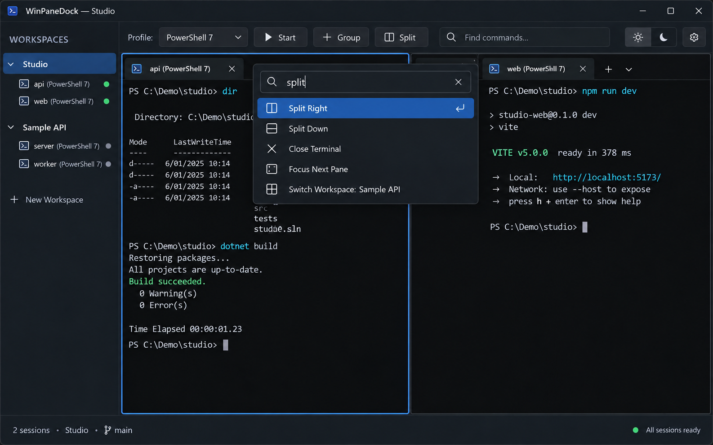

# WinPaneDock

Windows 桌面终端工作区管理器。WPF 界面嵌入官方 Windows Terminal 控件，ConPTY 会话由独立 SessionHost 持有；项目不实现终端模拟器。

应用显示名称为 WinPaneDock。兼容现有会话与配置的 `cmux.exe` 命令、MSIX 身份和内部路径保持原名。

> **仓库状态：开发中的源码，不是可直接安装的发布版本。** 这里不提供预编译安装包。请按[从源码构建](#从源码构建)自行构建。最新进展与未完成项见 [路线图](CMUX-Windows-ROADMAP.md)，可靠性与发布状态见 [docs/M10-RELIABILITY.md](docs/M10-RELIABILITY.md)。

## 功能

- **Workspace / Group / Pane**：多工作区，每个工作区下可建多个 Group，Group 内可切分 Pane
- **会话持久**：关闭窗口只 Detach，Shell 留在后台 SessionHost；重开应用重连同一会话
- **Agent 感知**：识别 Codex、Claude、Grok、Gemini，按 Pane 显示 Working / Waiting / Completed / Error
- **命令面板**：`Ctrl+Shift+P` 调出，同一入口也供 CLI 调用
- **CLI**：安装后 `cmux` 命令可用，通过命名管道控制正在运行的界面
- **主题**：Night / Day / Gray 三套界面主题

界面示意为合成图，非程序实拍：

| 双 Pane 工作区 | 四 Pane 工作区 | 命令面板 |
|---|---|---|
|  |  |  |

## 环境要求

| 项目 | 要求 | 备注 |
|---|---|---|
| 操作系统 | Windows x64，10.0.19041.0 及以上 | 清单声明的下限 |
| 架构 | x64 | `PlatformTarget` 固定 x64 |
| .NET SDK | 8.0.425（`global.json`，允许 `latestPatch`） | 仅构建需要；运行不需要 |
| PowerShell 7 | `pwsh` | **构建脚本和默认终端都需要** |
| Windows Terminal | 任意已安装版本 | 提供 `OpenConsole.exe`，见下 |
| Windows SDK | 仅打包 MSIX 需要 | 提供 `makeappx.exe` / `signtool.exe` |
| NuGet | 首次构建需联网 | 还原 NuGet 包 |

### 关于 OpenConsole.exe

本项目不自实现终端，用 `OpenConsole.exe`（ConPTY 控制台宿主）和官方 TerminalControl 控件。`OpenConsole.exe` **不提交到仓库**，构建时由 `scripts/Copy-OpenConsole.ps1` 按以下顺序解析：

1. `-OpenConsolePath` 参数或 `CMUX_OPENCONSOLE_PATH` 环境变量
2. `packaging/.openconsole` 缓存
3. 本机已安装的 Windows Terminal 包（取版本号最高的一个）

**任意 Windows Terminal 版本都可以构建。** 与 `packaging/terminal-engine.json` 记录的参考组合不一致时只会给出警告，实际使用的来源和 SHA-256 会写入包内 `build-metadata.txt`，以便追溯。需要严格可复现的发布构建时传 `-RequireReferenceBuild`。

如果机器上没有 Windows Terminal：

```powershell
winget install --id Microsoft.WindowsTerminal
```

## 从源码构建

### 最快路径：只看一眼效果

```powershell
git clone https://github.com/jiajialin-shuai/WinPaneDock.git
cd WinPaneDock
dotnet build spikes/M0.Terminal.Wpf/M0.Terminal.Wpf.csproj -c Release
.\spikes\M0.Terminal.Wpf\bin\Release\net8.0-windows\Cmux.Spike.Terminal.exe
```

**不需要打包 MSIX，也不需要签名。** 上面的 `dotnet build` 会把 GUI、SessionHost、CLI 和 OpenConsole 一起复制到输出目录，可直接运行。

### 打包成可安装的 MSIX

```powershell
pwsh -NoProfile -File scripts/M10.Build-Msix.ps1      # 生成 artifacts/WinPaneDock-<version>-x64-unsigned.msix
pwsh -NoProfile -File scripts/M10.Sign-Dev-Msix.ps1   # 自签开发证书，生成 -dev.msix
```

安装（脚本需用 Windows PowerShell 运行）：

```powershell
powershell.exe -NoProfile -File scripts/M10.Activate-Dev-Update.ps1
```

安装脚本会在 GUI 或活动会话仍在运行时**拒绝更新**，不会替你结束正在跑的终端。

> **自签名证书的适用范围**：`M10.Sign-Dev-Msix.ps1` 生成的是 `CN=cmux-dev` 自签名证书，仅供本机与受信任测试机使用。安装到其他机器前需要先信任 `artifacts/cmux-dev.cer`（导入到受信任的证书存储）。**不能作为面向公众分发的凭证**，私钥也不可分发。若要对外发布，需改用受信任的代码签名证书并同步修改 `packaging/AppxManifest.xml` 的 `Publisher`。

### 运行回归测试

`scripts/Test.ps1` 是统一回归入口：

```powershell
pwsh -NoProfile -File scripts/Test.ps1 -Configuration Release
```

默认只跑 Core 检查（构建 + 工作区/布局/Agent/Git/回放/会话宿主/背压/输入分片/lease 等）。加 `-IncludeDesktop` 才会运行 WPF 恢复与重连门，**该门需要真实桌面会话，请在没有要紧终端时运行**。

测试通过 `CMUX_INSTANCE_ID` 使用独立实例 ID 与独立布局路径，**不会连接或结束你已安装版本的会话**。另有一个只读性能采样脚本：

```powershell
pwsh -NoProfile -File scripts/M12.Performance-Baseline.ps1   # 只读采样，不打开或修改会话
```

## 使用

- 首次启动自动建立 Group 并运行 **PowerShell 7**。顶部可选 Profile；`+ Group` 与 Split 使用当前选择启动独立终端。
  - 若没有安装 PowerShell 7，首个终端会启动失败。可在 Profile 下拉框改选其他 Shell，或编辑 `%LOCALAPPDATA%\cmux\profiles.json`。
- 终端标题栏的 × 或 **Close Terminal** 结束单个会话；**Close Group** 结束整组；命令面板 `Close All Terminals` 结束全部会话。关闭应用窗口只断开界面，Shell 留在后台。
- Workspace 的 **Root Directory** 应用后作为默认启动目录；Profile 显式设置的 `startingDirectory` 优先。
- 快捷键：

  | 快捷键 | 作用 |
  |---|---|
  | `Ctrl+Shift+P` | 命令面板 |
  | `Alt+D` | 向右切分 Pane |
  | `Alt+Shift+D` | 向下切分 Pane |
  | `Alt+方向键` | 按方向切换 Pane 焦点 |
  | `Ctrl+V` | 粘贴 |

- 状态栏与侧栏会显示当前 Pane 的目录、Git 分支和 Agent 状态。

### 配置与数据位置

全部位于 `%LOCALAPPDATA%\cmux\`：

| 文件 | 内容 |
|---|---|
| `profiles.json` | Shell Profile 列表 |
| `terminal-settings.json` | 字体、字号、光标、配色、留白 |
| `ui-theme.txt` | 界面主题（Night / Day / Gray） |
| `workspace-state.json` | 工作区、Group、Pane 布局 |
| `logs\` | 运行日志，见 [日志与排障](docs/LOGGING.md) |

卸载 MSIX **不会**删除这个目录，需要时自行清理。

## 已知问题

诚实起见，以下是当前明确未完成或已知有缺陷的部分：

- **未接入正式 Windows Toast**：等待提醒仍使用通知区域气泡，见 [docs/M4.3-NOTIFICATION.md](docs/M4.3-NOTIFICATION.md)
- **终端设置受限**：WPF 控件没有背景透明度与 Scrollback 长度接口，原生层历史长度固定为 9001 行，见 [docs/M1.2-SETTINGS.md](docs/M1.2-SETTINGS.md)
- **cwd 自动上报只覆盖 PowerShell**：CMD、Git Bash、WSL 和自定义 Shell 没有自动 cwd hook，需手动 `cmux cwd <目录>`，见 [docs/M7-GIT-CONTEXT.md](docs/M7-GIT-CONTEXT.md)
- **内置冒烟门仍有失败**：`--tab-smoke`、`--cwd-smoke`、`--palette-smoke` 在当前代码下失败（`OpenProcess` 访问被拒、cwd 未上报、命令面板关闭未移除 Pane），详见 [docs/OPTIMIZATION-REVIEW-2026-09-24.md](docs/OPTIMIZATION-REVIEW-2026-09-24.md)
- **复杂 TUI 恢复有边界**：每个会话最多缓存 100 万字符，超出后无法保证复杂 TUI 完整恢复；宿主崩溃后不会自动重建原 Shell，见 [docs/M10-RELIABILITY.md](docs/M10-RELIABILITY.md)
- **未完成验收**：正式发布签名、完整"键盘输入到终端渲染"延迟量化验收
- **无自动化测试项目**：全部回归依赖 PowerShell 冒烟脚本，仓库中没有 xUnit 测试项目

## 仓库结构

```text
spikes/M0.Terminal.Wpf/   WPF 界面（GUI 入口、终端控件、MainWindow.Smoke.cs 内置门）
src/Cmux.Core/            Workspace / Group / Pane 模型、布局持久化、Agent 检测、Git 上下文
src/Cmux.Terminal/        ConPTY 封装、SessionHost 客户端、输入分片
src/Cmux.SessionHost/     独立会话宿主进程（持 Shell 生命周期）
src/Cmux.Cli/             本机 CLI（cmux）
packaging/                MSIX 清单模板、图标、终端引擎版本与哈希
scripts/                  构建、打包、签名、回归与冒烟脚本
docs/                     阶段验收记录、ADR、日志与主题说明
```

源码入口在 `spikes/M0.Terminal.Wpf/`。架构决策记录见 `docs/ADR-*`，阶段验收见 `docs/M*-*.md`。

## 架构原则

本项目是 **Terminal Workspace Manager，不是 Terminal Emulator**。

不自己实现 VT 解析、字形渲染、鼠标协议编码或 ConPTY。终端引擎、渲染与 ConPTY 由官方 Windows Terminal 组件承担，研发资源集中在 Workspace、Pane、Session、Agent 集成与自动化。

## 文档索引

| 文档 | 内容 |
|---|---|
| [CMUX-Windows-ROADMAP.md](CMUX-Windows-ROADMAP.md) | 里程碑 M0–M10 状态与历史进度 |
| [docs/M10-RELIABILITY.md](docs/M10-RELIABILITY.md) | **当前发布与可靠性状态** |
| [docs/OPTIMIZATION-REVIEW-2026-09-24.md](docs/OPTIMIZATION-REVIEW-2026-09-24.md) | O1–O12 优化评审与实施记录 |
| [docs/LOGGING.md](docs/LOGGING.md) | 日志位置与排障 |
| [docs/THEMES.md](docs/THEMES.md) | 界面主题与 CLI 配色 |
| [docs/ADR-0001…0011](docs/) | 架构决策记录 |
| `docs/M0…M9-*.md` | 各里程碑验收证据 |

`artifacts/` 保存本机生成的截图、预览构建和 MSIX，已被 `.gitignore` 排除，因此部分文档引用的本机截图不会随仓库提供。

## 许可

项目自有代码采用 [MIT 许可证](LICENSE)。

随包分发的第三方组件（OpenConsole、TerminalControl、.NET 运行时）保留各自版权与许可，详见 [NOTICE](NOTICE)。
